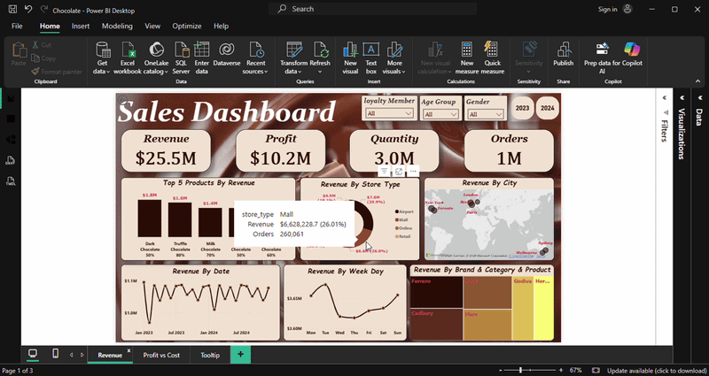
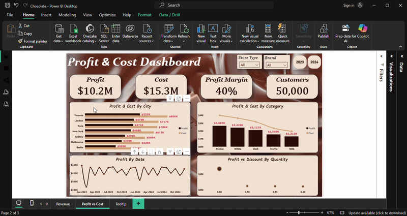

# Sales-Analysis-Dashboard

## Description

This project features two interactive Power BI dashboards for a chocolate company, using Power Query and DAX.

The first dashboard focuses on sales performance, breaking down revenue by category, store type, region, and time.

The second dashboard analyzes profit over time, showing the relationship between profit and cost across categories and regions, as well as the relationship between profit, discount, and quantity. 

## Data & Tools Used

**Data** -  Sales Data containing over 1000000 records across 2023 and 2024.

**Data Cleaning & Analysis** - Power Query & DAX

**Data Visualization** - Power BI ([Chocolate.pbix](Chocolate.pbix))

## Objective

Provide a clear, data-driven view of the company's sales and profit performance.

It aims to help stakeholders identify top-performing products, analyze profitability by region and category, and guide strategic decisions to optimize revenue and margins.   

## Key Insights

  
## Recommendations

