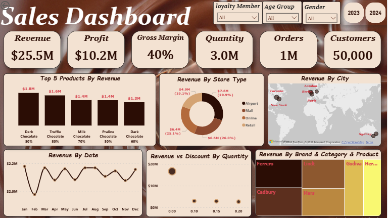
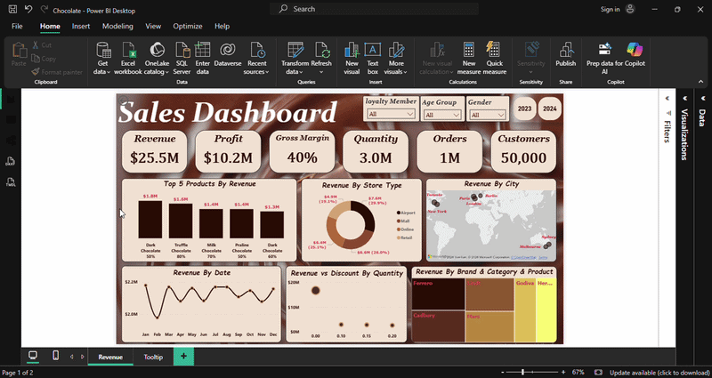

# Sales-Analysis-Dashboard

## Description

-This project features an interactive Power BI dashboard for a chocolate company, built using Power Query and DAX.

-The dashboard focuses on sales performance, breaking down revenue by category, store type, city, and time, and showing the relationship between profit, discount, and quantity. 

## Data & Tools Used

**Data** -  Sales Data containing over 1,000,000 records across 2023 and 2024.

**Data Cleaning & Analysis** - Power Query & DAX

**Data Visualization** - Power BI ([Chocolate.pbix](Chocolate.pbix))

## Objective

Provide a clear, data-driven view of the company's sales and profit performance.

It aims to help stakeholders identify top-performing products, analyze profitability by region and category, and support strategic decisions to optimize revenue and margins. 

## Dashboard Features

- Interactive filters by year, gender, age group, loyalty membership, and store type.
- Drill-down analysis across time periods, brands, categories, and products.
- Scatter chart to analyze the relationship between profit and discount, with quantity represented by point size.
- Map visualization showing revenue distribution by city.

## Data Model 

- Fact Table: Sales.
- Dimension Tables: Products, Customers, Stores, and Date.
- Relationships built using customer_id, product_id, store_id, and order_date.  

## Key Insights

- The total revenue over 2023 and 2024 was $25.5M, with a profit $10.2M. Both years achieved the same quantity and order numbers: 1.5M units and 500k orders in each year. the difference was in revenue: in 2023, revenue was $12.7M, while in 2024, revenue was $12.8M. However, the profit remained equal at $5.1M for both years.
- The top product by revenue is the Dark Chocolate 50%, generating $1.8M, afterthat, Truffle Chocolate 80% achieved $1.6M, followed by Milk Chocolate 70%, with $1.4M.
- The Airport store is the highest in revenue, contributing about 30% ($7.6M), while the retail store had the lowest share at 19% ($4.9M).
- The top city by revenue is Toronto, with $4.6M, while the lowest revenue city is Berlin, with $2.6M.
- Toronto is the highest revenue per customer, with 94.4$, while the lowest is Berlin, with $59.1.
- The top brand by revenue is ferrero, with $4.7M, while the lowest revenue brand is Hershey, with $3.5M.
- Jan 2023 was the highest month, achieving $1.1M in revenue, while Feb 2023 was the lowest, with $969K.
- Quarter 3 was the highest quarter in both years, achieving the greatest revenue in each year, while quarter 1 and quarter 2 were the lowest.
- The highest day of the week in revenue was Tuesday, while the lowest day was Thursday.
- The revenue generated by loyalty members was slightly higher, but not significantly different from non-members, due to a slightly higher number of loyalty members, and the same applied to gender.
- Revenue and profit are directly proportional, as the gross margin remains constant in all cases.
- the revenue in the absence of a discount was significantly higher compared to the revenue when a discount was applied, and the same applied to quantity.
  
## Recommendations

- Increase focus on top-performing products, such as Dark Chocolate 50%, Truffle Chocolate 80%, and Milk Chocolate 70% to maximize revenue.
- Prioritize airport stores due to their high revenue contribution, while optimizing retail store performance through targeted strategies. 
- Expand and optimize operations in Toronto, the top city by revenue and revenue per customer.
- Intensify promotional campaigns and increase special offers during quarter 3 to sustain and further boost sales momentum. 
- Shift from board demographic targeting to behavioral segmentation by leveraging customer purchase patterns and preferences to drive highly personalized marketing strategies.  
- Re-evaluate the loyalty membership program, as the current loyalty offering is not effectively driving incremental value, and redesign it to provide clear benefits and stronger incentives to drive member engagement and boost revenue.
- Reduce or eliminate large discounts and instead focus on value-added strategies, such as bundling, loyalty rewards, and targeted marketing, to drive sustainable growth.       
